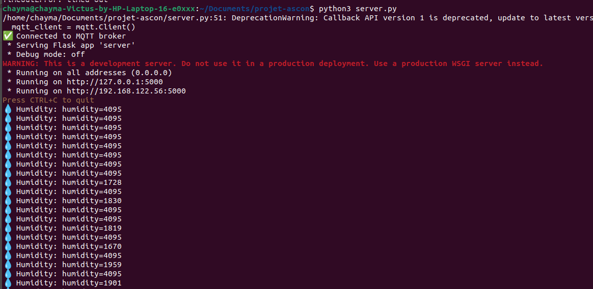
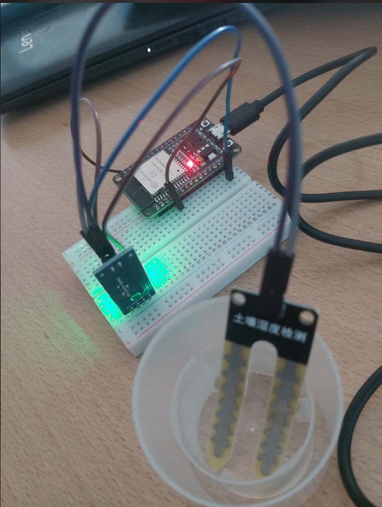
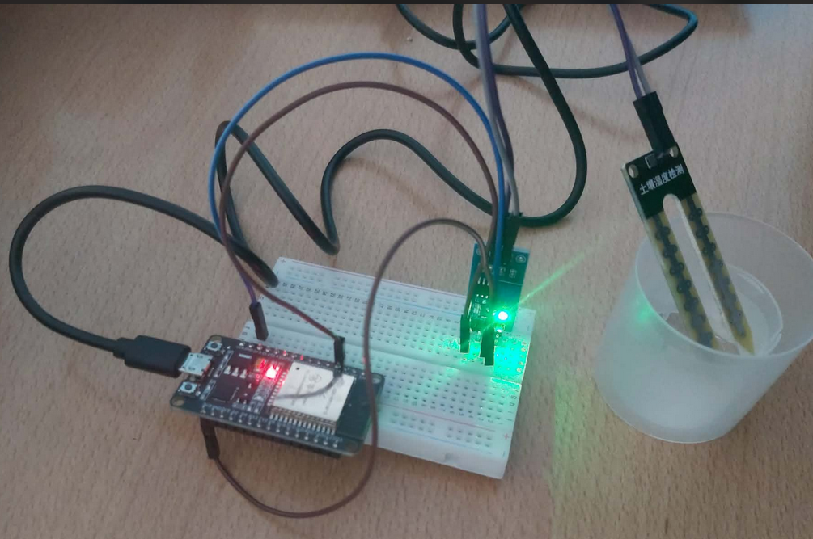

# Secure IoT Communication Using MQTT

## 📌 Project Overview
This project implements a **secure IoT communication system** using an **ESP32** device and the **MQTT publish/subscribe model**.  
Sensor data is protected using **ASCON-128 authenticated encryption**, ensuring **confidentiality, integrity, and authenticity** of the transmitted messages.

The system is designed for **resource-constrained IoT devices**, where lightweight cryptography is required.

---

## 🏗️ System Architecture
The system is composed of:
- An ESP32 device acting as a **publisher**
- An MQTT broker
- A server application acting as a **subscriber**
- A lightweight cryptographic layer based on ASCON-128

---

## 🔐 Security Features
The project ensures:
- **Confidentiality**: sensor data is encrypted
- **Integrity**: data tampering is detected using an authentication tag
- **Authenticity**: messages are verified as coming from a legitimate device
- **Replay attack protection**: nonces prevent message reuse

---

## 🔑 Cryptography
- Algorithm: **ASCON-128**
- Mode: Authenticated Encryption with Associated Data (AEAD)
- Components used:
  - Secret key
  - Nonce (unique per message)
  - Authentication tag

ASCON is a lightweight cryptographic algorithm suitable for IoT devices and selected by NIST.

---

## 🔄 Communication Model (MQTT)
- The ESP32 **publishes** encrypted sensor data to a topic
- The server **subscribes** to the same topic
- Messages are decrypted and verified on reception

---

  

  

  

  

